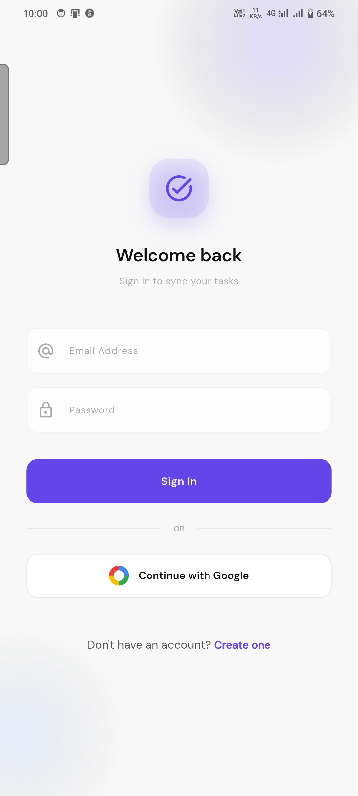
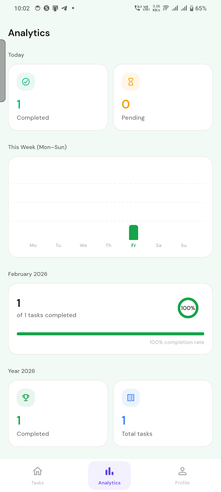

# 🚀 Smart To-Do Planner

A minimalist, production-ready Flutter productivity app that helps users manage tasks and track their productivity with powerful analytics.

---

## 📱 App Overview

**Smart To-Do Planner** is a clean and modern task management application built with Flutter.
It allows users to organize daily tasks, categorize them, set due dates, and visualize productivity through day, week, month, and year analytics.

The app follows a **minimalist premium UI** design and is structured using **Provider state management** and **Firebase backend** for real-time sync.

---

## ✨ Features

* ✅ Add, edit, delete tasks
* ✅ Mark tasks as completed
* ✅ Task categories/tags
* ✅ Due date & time picker
* ✅ Search tasks
* ✅ Daily progress indicator
* ✅ Productivity analytics (Day / Week / Month / Year)
* ✅ Google Sign-In authentication
* ✅ Cloud Firestore sync
* ✅ Local caching with SharedPreferences
* ✅ Swipe to delete (Slidable)
* ✅ Minimalist premium UI
* ✅ Dark/Light theme toggle
* ✅ Empty state UI

---

## 🧠 Tech Stack

**Framework:** Flutter (Null Safety)
**State Management:** Provider
**Backend:** Firebase Auth + Cloud Firestore
**Local Storage:** SharedPreferences
**Charts:** fl_chart
**UI/UX:** Google Fonts, Material 3

---

## 📦 Packages Used

```yaml
provider
google_fonts
lottie
shared_preferences
fl_chart
flutter_slidable
percent_indicator
firebase_core
firebase_auth
cloud_firestore
google_sign_in
```

---

## 📊 Analytics Included

* 📅 Daily productivity
* 📆 Weekly performance (Bar chart)
* 🗓 Monthly completion stats
* 📈 Yearly summary

---

## 📸 Screenshots

> ⚠️ Replace these with your actual screenshots

 Splash                            
 
 Home.
 
Analytic
 

 

 

 

 

 

 

---

## 🔐 Firebase Setup

1. Create Firebase project
2. Enable Google Authentication
3. Enable Cloud Firestore
4. Add Android app in Firebase
5. Download `google-services.json`
6. Place inside:

```
android/app/google-services.json
```

7. Run:

```
flutter pub get
```

---

## ▶️ How to Run

```bash
flutter pub get
flutter run
```

---

## 🏪 Play Store Readiness

✔ Null-safe code
✔ Responsive UI
✔ Clean architecture
✔ Minimalist design
✔ Production-ready build

---

## 👨‍💻 Author

**Mohd Danish**
Flutter Developer 🚀
GitHub: https://github.com/mohddanish305

---

⭐ If you like this project, give it a star!
